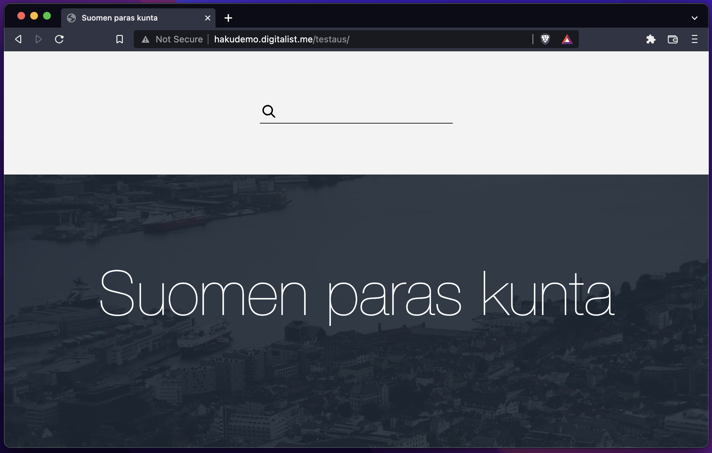
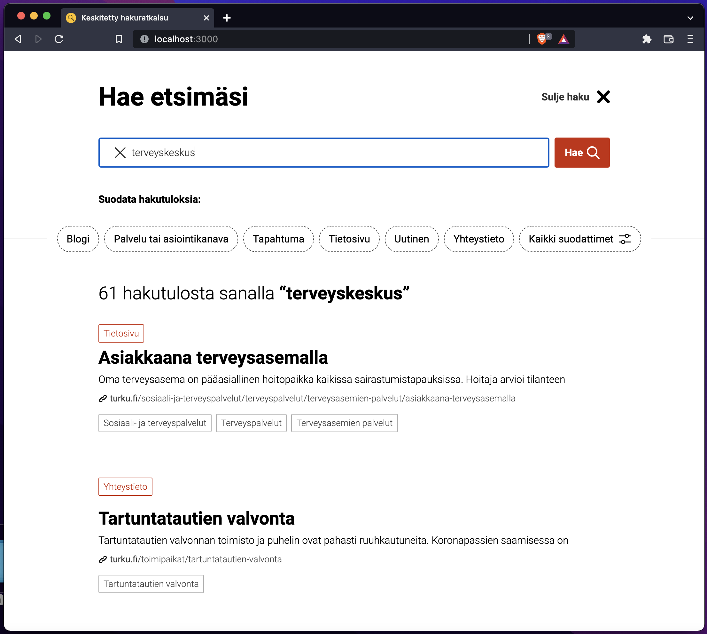
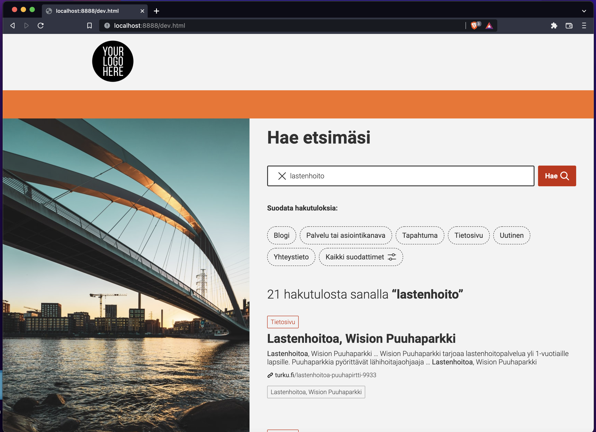

# UI Dokumentaatio (Keskitetty Hakuratkaisu)

Versio 0.1

Hakuratkaisun käyttöliittymä on React-sovellus joka voidaan upottaa kunnan omien verkkosivujen sisälle, ja sen tyyliä voidaan hieman muokata jotta se sulautuu verkkosivuihin sekä visuaalisesti että toiminnallisesti.

# Sisältö

1. [Upotustapa](#upotustapa)
2. [React-sovelluksen käännös](#react-sovelluksen-käännös)
3. [Upotuselementin konfiguraatio](#upotuselementin-konfiguraatio)
4. [Tyylien muokkaus](#tyylin-muokkaus)

# Upotustapa

Käyttölittymä voidaan upottaa verkkosivuihin kahdella eri tyylillä: **widget** tai **inline**.

a) **Widget**-tyylillä verkkosivusto selaillessa näkyy normaalitilanteessa vain pieni ja yksinkertainen hakukenttä jossa suurennuslasi-ikoni ilmaisee kyseessä olevan hakutoiminnon. Tätä klikkaamalla avautuu koko ikkunan kokoinen alue, missä haku suoritetaan ja hakutulokset näytetään. Tyyli soveltuu käytettäväksi esimerkiksi verkkosivuston ylätunnisteessa. 




b) **Inline**-tyylillä hakukenttä ja myös tulokset ovat upotettuna suoraan verkkosivuun ilman erillistä avautuvaa aluetta.



Molempia upotustyylejä voi halutessaan käyttää samalla verkkosivulla yhtä aikaa.

Upotustyyli valitaan upotuselementin `data-mode`-attribuutilla. Katso kappale [upotuselementin konfiguraatio](#upotuselementin-konfiguraatio).

# React-sovelluksen käännös

Jotta sovellus voidaan upottaa verkkosivustoon, sovelluksen JavaScript-tiedostot tulee kääntää ja siirtää verkkosivuston palvelimelle.

Vaatimukset:
* NodeJS
* Yarn

Käännösprosessi:
```
$ cd search_ui
$ yarn install
$ yarn build

$ ls -1 build/static/js/*js
2.87fc67e5.chunk.js
main.43e37c5c.chunk.js
runtime-main.4ef503da.js
```

Tuloksena yllä olevassa esimerkissä on kolme javascript-tiedostoa (.js), jotka tulee kopioida ja ajaa halutulla verkkosivustolla.

Halutessasi voit myös yhdistää kolme tiedostoa yhdeksi tiedostoksi, jolloin se on yksinkertaisempi käsitellä:
```
cat build/static/js/2.*.js \
    build/static/js/main.*.js \
    build/static/js/runtime*.js \
    > full-bundle.js
```

# Upotuskoodi

Kun olet saanut UI-sovelluksen käännettyä yllä olevalla ohjeella, tulee se upottaa verkkosivustolle seuraavasti.

```
<script src='/full-bundle.js'></script>
```

Lisäksi siihen kohtaan verkkosivuston rakenteessa mihin hakupalvelu halutaan lisätä, tulee seuraava elementti:

```
<div class='keskitetty-hakuratkaisu' data-mode='...' data-backendroot='...' />
```

# Upotuselementin konfiguraatio

Alla oleva taulukko kertoo elementin tukemat konfiguraatio-attribuutit.

| Attribuutti | Mahdolliset arvot / tyyppi | Selitys |
|-|-|-|
| `class` | `keskitetty-hakuratkaisu` | Pakollinen. Luokan avulla React-sovellus syöttää elementtiin tarvittavan sisällön. |
| `data-mode` | `widget` tai `inline` | Valitsee opetustyylin. Oletuksena `inline`. |
| `data-backend-root` | URL | URL-osoite jossa hakupalvelun backend-palvelin vastaa. Oletuksena http://localhost:5000. |
| `data-accent-color` | CSS-värimääritys | Hakukäyttöliittymän korostusväri. Oletuksena `#C82A07`. |
| `data-disable-more-filters` | N/A | Mikäli attribuutti on lisätty elementtiin (arvolla ei merkitystä, voi olla myös tyhjä), käyttöliittymästä poistuu "Lisää suodattimia" painike. |

# CSS-tyylien muokkaus

Tyylien muokkaus tapahtuu verkkosivuston omia tyylitiedostoja muokaten ja osoittaen tyylit koskemaan hakuratkaisun juuriluokkaa, `.keha-ui-application`.

Alla olevat koodiesimerkit käyttävät osittain *less*-syntaksia.

## Aksenttiväri

Kts. kappale [Upotuselementin konfiguraatio](#upotuselementin-konfiguraatio).

## Kirjasin (fontti)

Hakusovelluksen oletusfontti on *Roboto*. Fontin voi vaihtaa esimerkiksi tyylimäärityksellä:

```
.keha-ui-application,
.keha-ui-application input,
.keha-ui-application button {
  font-family: monospace;
}
```

## Muut tyylit

Muitakin tyylejä voi halutessaan kustomoida (esimerkiksi typografian kokoja tai marginaaleja), vaikkakin tarvetta ei liiemmin luultavasti ole. Käyttöliittymän komponentteihin on (pelkästään) tätä varten liitetty css-luokkia, joiden alkuosa on `.kehauicss-`, esimerkiksi `.kehauicss-result-title` (hakutuloksen otsikko).
